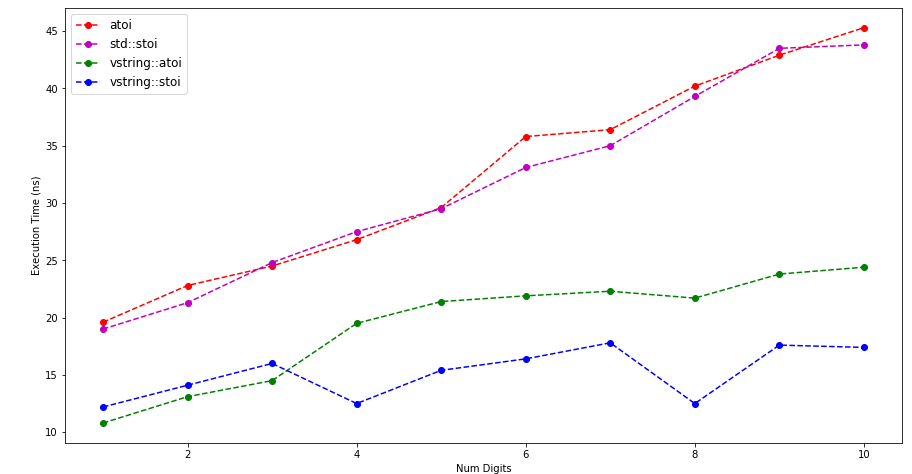

# vstring - Vectroized String Helper Functions

A header only string  helper library.

### Dependencies

- gcc-7.1+ (or OpenMP 4.0+ supported compiler)
- [google-test](https://github.com/google/googletest)
- [google-benchmark](https://github.com/google/benchmark)
- cmake 3.5+

### Build Instructions

```bash
git clone https://github.com/sahmad98/vstring
cd vstring
mkdir build
cd build
cmake ..
make -j 4
```

### Binaries

- `vstring_bench` - Benchmark Binary
- `vstring_test` - Test Binary

### Benchmarks

#### Machine Specs

```bash
Architecture:        x86_64
Vendor ID:           GenuineIntel
Model name:          Intel(R) Core(TM) i5-3210M CPU @ 2.50GHz
CPU MHz:             2893.361
CPU max MHz:         3100.0000
CPU min MHz:         1200.0000
L1d cache:           32K
L1i cache:           32K
L2 cache:            256K
L3 cache:            3072K
NUMA node0 CPU(s):   0-3
Memory Size:         8 GB
```

Benchmark Results

`stoi` ran on all digits from 0 to 10. Following are stoi  benchmark implementations

- `Atoi` - C library atoi
- `Stoi` - C++ `std::stoi`
- `VStoi` - `vstring::atoi` (implemented with OpenMP simd support)
- `VStoiIntrinsic` - `vstring::stoi` (some part implementated with instrinsics and rest with OpenMP simd)



```bash
Running ./vstring_bench
Run on (4 X 3100 MHz CPU s)
CPU Caches:
  L1 Data 32K (x2)
  L1 Instruction 32K (x2)
  L2 Unified 256K (x2)
  L3 Unified 3072K (x1)
Load Average: 0.92, 1.09, 1.05
-------------------------------------------------------------
Benchmark                   Time             CPU   Iterations
-------------------------------------------------------------
Atoi<0>                  19.6 ns         19.6 ns     41268339
Atoi<1>                  22.8 ns         22.8 ns     32894575
Atoi<2>                  24.5 ns         24.5 ns     29373132
Atoi<3>                  26.8 ns         26.7 ns     24318895
Atoi<4>                  29.6 ns         29.6 ns     23678912
Atoi<5>                  35.8 ns         35.8 ns     19980500
Atoi<6>                  36.4 ns         36.4 ns     18261115
Atoi<7>                  40.2 ns         40.2 ns     18080404
Atoi<8>                  42.9 ns         42.8 ns     13336815
Atoi<9>                  45.3 ns         45.3 ns     14880288
Stoi<0>                  19.0 ns         19.0 ns     33468114
Stoi<1>                  21.3 ns         21.3 ns     31283041
Stoi<2>                  24.8 ns         24.7 ns     28999860
Stoi<3>                  27.5 ns         27.5 ns     25007227
Stoi<4>                  29.5 ns         29.5 ns     23115277
Stoi<5>                  33.1 ns         33.1 ns     21241968
Stoi<6>                  35.0 ns         35.0 ns     19328284
Stoi<7>                  39.3 ns         39.3 ns     18516857
Stoi<8>                  43.5 ns         43.5 ns     16204777
Stoi<9>                  43.8 ns         43.8 ns     15975854
VStoi<0>                 10.8 ns         10.8 ns     62055430
VStoi<1>                 13.1 ns         13.1 ns     57126175
VStoi<2>                 14.5 ns         14.5 ns     48849490
VStoi<3>                 19.5 ns         19.5 ns     35795502
VStoi<4>                 21.4 ns         21.4 ns     32649288
VStoi<5>                 21.9 ns         21.9 ns     32154079
VStoi<6>                 22.3 ns         22.3 ns     31604697
VStoi<7>                 21.7 ns         21.7 ns     32205287
VStoi<8>                 23.8 ns         23.8 ns     29113004
VStoi<9>                 24.4 ns         24.4 ns     28820527
VStoiIntrinsics<0>       12.2 ns         12.2 ns     56700711
VStoiIntrinsics<1>       14.1 ns         14.1 ns     49328995
VStoiIntrinsics<2>       16.0 ns         16.0 ns     44196694
VStoiIntrinsics<3>       12.5 ns         12.5 ns     55843771
VStoiIntrinsics<4>       15.4 ns         15.4 ns     44830579
VStoiIntrinsics<5>       16.4 ns         16.4 ns     43328013
VStoiIntrinsics<6>       17.8 ns         17.8 ns     37701897
VStoiIntrinsics<7>       12.5 ns         12.4 ns     55005961
VStoiIntrinsics<8>       17.6 ns         17.5 ns     43247715
VStoiIntrinsics<9>       17.4 ns         17.4 ns     40614609

```


